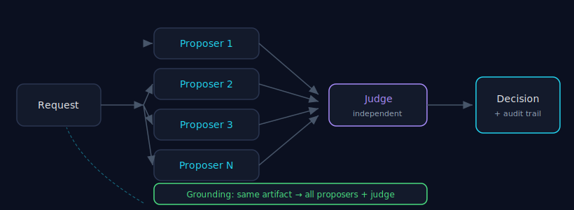

# Architecture

> Part of the [Council MCP](../README.md) documentation suite. This describes how a
> decision is produced, framed from the decision — not from the wire protocol.
> Council owns **DECISIONS ONLY**; execution lives in
> [ANS](../README.md#council-in-the-tokonomix-ecosystem), not here.

**30-second version.** A request fans out to several independent proposers, an
independent judge reconciles their answers, and the result comes back with an audit
trail — who answered, who judged, what it cost, and a request id you can rate later.
Models are selected for **decorrelation over raw score**; routing honours **EU data
residency**; configuration lives on the key, not in your prompt.



---

## 1. The decision pipeline

```
  request ──► proposers (parallel + blind) ──► judge (independent) ──► decision + audit trail
                │                                   │
            grounding (same artifact to all)    reconciliation per chosen mode
```

A call to [`tokonomix_consensus_ask`](../README.md#tools) runs in two stages:

1. **Proposer fan-out.** Your prompt (plus any inline [grounding](./grounding.md)) is
   sent to 2–6 proposer models **in parallel and blind**. The server records each
   proposer's answer and its cost in a per-model breakdown.
2. **Judge reconciliation.** An **[independent judge](./judge-independence.md)** —
   disjoint from the proposers, cross-family, never scoring its own answer —
   produces the synthesis for your chosen
   [mode](./consensus.md#2-pick-the-mode-by-intent). (`raw` mode skips the judge.)

The total cost is the proposers' cost **plus** the judge's cost; both appear in the
result so the price of a decision is never hidden.

This is the whole responsibility. Council does not schedule the work, retry a
backlog, route between providers as a product, or remember prior sessions — those
are separate Tokonomix components ([ecosystem
map](../README.md#council-in-the-tokonomix-ecosystem)). Council turns *several
independent answers into one defensible decision*, and stops there.

## 2. The audit trail

Every consensus call returns metadata you can inspect and act on — the `x_council`
block and the billing line:

- **`request_id`** — a stable id for the call, shown in the billing breakdown and in
  `x_council.request_id`. Use it to [rate the call](./auditability.md) later via
  [`tokonomix_rate_consensus`](../README.md#tools).
- **per-model breakdown** — which proposers ran and what each cost.
- **`charged_credits`** — the real charged cost (proposers + judge).
- **skipped models** — when you pin an explicit panel, models that could not serve
  the request (e.g. a non-vision model on an image prompt) are reported as skipped
  rather than silently dropped.

This is what makes a Council decision *auditable*: you can see who said what, who
judged, what it cost, and tie a real-world outcome back to the call. See
[Auditability](./auditability.md).

## 3. Empirical model selection — decorrelation over score

The panel is not "the top-N models by leaderboard score." It is chosen for
**decorrelation** — different families with different blind spots — because the
value of a council comes from independence, not from stacking the single
highest-scoring model with near-copies of itself (see [Decision
Theory](./decision-theory.md) and [Failure Modes](./failure-modes.md#4-specialist--proposer-overlap--diminishing-and-negative-returns)).

You control the panel in three ways:

- **Leave `models` empty** to use the **per-key or per-account default council**
  configured on your key — the recommended path, so panel policy lives in
  configuration, not in every prompt.
- **Pin an explicit panel** by passing `models` (2–6 bare slugs) and, optionally,
  `judge_model` / `judge_models`.
- **Discover slugs** with [`tokonomix_list_models`](../README.md#tools), filtering
  by capability, tier, provider, or region.

## 4. Routing and EU data residency

Routing is a concern Council *consumes*, not one it owns — but two properties are
visible at this layer and matter for decisions about personal or regulated data:

- **`hosting_region` filtering.** `tokonomix_list_models({hosting_region:"eu"})`
  returns only EU-hosted models (`eu` matches `eu` or `fr`); `origin_country`
  filters by the lab's headquarters for sovereignty-aware selection.
- **EU-default for sensitive paths.** Region-pinned features default to EU (for
  example, staged context is region-pinned EU by default). For prompts containing
  personal data, route to an EU council. See [Routing](./routing.md).

Configuration — the default council, per-key policy, region preferences — lives on
the key/account server-side, so the same governance applies to every call without
re-specifying it in the prompt.

## 5. Where the work happens

The MCP server is a thin client: it shapes your call, forwards it to the Tokonomix
gateway (`https://tokonomix.ai/api/v1` by default, override with `TOKONOMIX_BASE_URL`),
and returns the decision with its audit trail. The proposer fan-out, the judge
reconciliation, grounding, billing, and policy enforcement happen server-side. Your
credential is `TOKONOMIX_API_KEY` (or `~/.tokonomix/credentials.json`, written by
[onboarding](./tutorial-getting-started.md)). The connection details and full tool
list are in the [README](../README.md).

---

### See also

- [Decision Theory](./decision-theory.md) — why the pipeline is shaped this way.
- [Judge Independence](./judge-independence.md) — the reconciliation stage.
- [Grounding](./grounding.md) — feeding the same artifact to every model.
- [Auditability](./auditability.md) — using the request id and the trail.
- [Routing](./routing.md) — selection and EU-default routing in depth.
