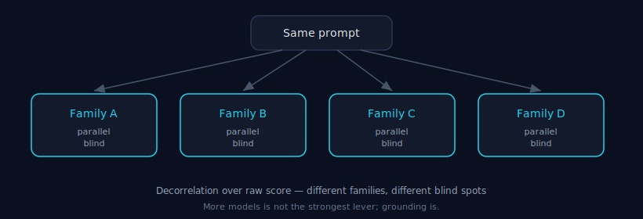

# Decision Theory

> Part of the [Council MCP](../README.md) documentation suite. Council owns one
> responsibility — **the decision**. It does not execute, schedule, route, or
> remember; those live in their own components (see the
> [ecosystem map](../README.md#council-in-the-tokonomix-ecosystem)).

**30-second version.** A single model gives you one perspective, shaped by one
training run and one set of blind spots. For a decision whose cost-of-being-wrong
is high, one perspective is a gamble. Decision theory is the study of how to turn
several independent perspectives into one defensible choice. Council applies it to
LLMs: independent models reason in parallel, an independent judge reconciles them,
and grounding ties the result to the real artifact. **Consensus is a means; a
better decision is the goal.**

---

## 1. One model is one perspective

A frontier LLM is a single estimator. Ask it the same hard question twice and you
may get two different answers; ask two different models and you will often get a
disagreement that neither would have surfaced alone. This is not a defect to be
engineered away — it is information. The disagreement *is* the signal that the
question is genuinely uncertain.

A single model cannot give you that signal, for a structural reason:

- It has **one bias**. Its judgement is a function of its training data, its
  alignment, and its decoding. Those are fixed at inference time.
- It has **one set of blind spots**. The edge case it was never trained to notice,
  it will not notice — confidently.
- It **cannot independently verify itself**. The same weights that produced an
  answer produce its self-assessment. "Are you sure?" is asked and answered by the
  same estimator; a model that is wrong is frequently wrong *and* confident.

None of this means the model is weak. It means a model is the wrong tool for the
*verification* half of a decision. (This is argued in full in the
[Manifesto §3](./decision-engineering-manifesto.md).)

## 2. Why independence helps

The value of a second opinion comes from **decorrelation**, not from headcount.
Two estimators that share the same blind spot will agree and both be wrong. Two
estimators with *different* blind spots are unlikely to miss the same thing — so
when one of them catches the timing side-channel or the off-by-one, it surfaces.

This is why Council selects proposers for **decorrelation over raw score** (a
cross-family panel), runs them **parallel and blind** (no model sees another's
answer, so nobody capitulates in debate), and uses an **independent judge**
disjoint from the proposers that never scores its own answer. The design is what
makes the panel useful — not the number of models. (How the panel is built:
[Judge Independence](./judge-independence.md).)

> **The honest limit.** More models is *not* the strongest lever, and agreement is
> *not* proof. Frontier models share training data, so they can be uniformly and
> confidently wrong on a shared blind spot. The strongest lever against that is
> **grounding** — checking the claim against the real artifact — not adding models.
> See [Grounding](./grounding.md).

## 3. Consensus is a means, not the goal

It is tempting to treat "the models agreed" as the deliverable. It is not. The
deliverable is **a decision you can act on and defend later**. Agreement is one
route to it; it is not the only one and it is not always the right one.

Decision theory frames the choice as a trade-off, not a vote:

- When the **cost of a missed error is high and asymmetric** (security review, a
  migration direction, a legal or compliance statement), it is worth paying for
  several independent perspectives plus an independent reconciliation.
- When the task is **routine and a strong single model already saturates it**,
  consensus adds cost and latency for no decision-quality gain. Use a single-model
  call ([`tokonomix_single_ask`](../README.md#tools)) instead.

Knowing *which* regime you are in is the actual skill. [Consensus](./consensus.md)
covers when consensus helps, when it does not, and when it can hurt — and
[Recall vs Precision](./recall-vs-precision.md) covers the cost side of the trade.

## 4. What "a better decision" means here

A better decision is not "the more accurate answer" — Council does **not** claim to
be more accurate, and our own benchmarks show it ties the best single model on
clean accuracy and beats it in no domain (see [Benchmark
Methodology](./benchmark-methodology.md)). A better decision is one that is:

- **Variance-eliminated** — you stop gambling on which single model you happened to
  ask; you get top-of-panel recall without needing to know in advance which model
  is strong for this task.
- **Disagreement-aware** — the dissent a single model would have smoothed away is
  surfaced for a human or an agent to adjudicate.
- **Grounded** — tied to the real artifact, not to the model's recollection of it.
- **Auditable** — you can see who said what, who judged, and on what evidence (see
  [Auditability](./auditability.md)).

That is the whole of decision theory as Council applies it: take the structural
weakness of a single estimator (one perspective, one bias, no self-verification),
and answer it with independence, grounding, and a recorded, defensible synthesis.

---

### See also

- [Consensus](./consensus.md) — the mechanism, and when to use which mode.
- [Judge Independence](./judge-independence.md) — why the judge is disjoint and cross-family.
- [Grounding](./grounding.md) — the strongest lever, stronger than more models.
- [The Decision Engineering Manifesto](./decision-engineering-manifesto.md) — the full argument.
- [Verification & Confidence & Bias](./verification.md) — why a model cannot verify itself.
