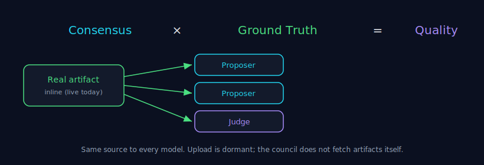

# Grounding

> Part of the [Council MCP](../README.md) documentation suite. Grounding is the
> single strongest lever on decision quality — **stronger than adding more
> models.** See [Decision Theory](./decision-theory.md) for why.

**30-second version.** Grounding means giving the council the *real artifact* — the
actual diff, log, spec, or file — so every proposer and the judge reason over the
same source instead of their recollection of it. The governing equation is
**Consensus × Ground Truth = Decision Quality**: consensus without ground truth can
launder a shared hallucination into false confidence. If you can attach the thing
the question is about, do — it does more for the decision than a sixth model would.



---

## 1. Why grounding beats more models

Frontier models share training data. That means they can be **uniformly and
confidently wrong** on a shared blind spot — and when they all agree, consensus
reports high confidence in a wrong answer. Adding a seventh model from the same era
does not fix this; it often *amplifies* the false agreement.

Grounding breaks the loop by changing what the models reason over. Asked "is there
a bug in this function?" with no code attached, every model reasons over a
remembered, generic version of the function and guesses. Asked the same question
with the **actual function pasted in**, they reason over the real thing — and a
real off-by-one or a real missing null-check becomes catchable. Same models, far
better decision, because the input is real.

This is why Council treats grounding as the primary lever and the council as
advisory: the deterministic check against the real artifact is worth more than the
vote.

## 2. What is LIVE today: inline context

The grounding path available today is **attaching artifact content inline**. On
[`tokonomix_consensus_ask`](../README.md#tools), pass `context.inline` as an array
of `{path, lang, content}` objects — verbatim file or snippet content. When
enabled, the server folds this content into the message so **all proposers AND the
judge** see identical grounding.

```jsonc
{
  "prompt": "Does this handler leak the API key on the error path?",
  "context": {
    "inline": [
      { "path": "src/auth.ts", "lang": "ts", "content": "<the actual file contents>" }
    ]
  }
}
```

> **Server-gated.** Inline context is honoured only when context-upload is enabled
> on the account; otherwise it is ignored. Grounding is a capability you turn on,
> not an unconditional default. If you are unsure whether it is active for your key,
> treat the call as ungrounded until you have confirmed it.

**Attach the real thing, not a description of it.** "A function that validates a
JWT" is not grounding; the function's source is. The whole point is to remove the
model's guess from the loop.

## 3. What is NOT yet available (do not rely on it)

To be precise about the current state — these are designed but **not live**, and
you should not build on them yet:

- **Large-file / staged upload** ([`tokonomix_upload`](../README.md#tools)) is
  **DORMANT** — it returns a clear "not enabled" message until the platform turns
  context-upload on. The `context.session` / `context.handles` path that consumes
  an upload session is the same dormant feature. Use small inline payloads instead.
- **The council fetching artifacts for you** (server-side fetch / auto-fetch of
  external sources) is **not** the live path. Provide the content yourself; do not
  assume the council will go and read a URL or a repository on your behalf.

When these land they will be documented here as available. Until then, the honest
statement is: **inline content, server-gated, is the grounding path.**

## 4. The grounding-gate (dormant / shadow-first)

A stronger behaviour is in progress: a **grounding-gate** that, instead of
guessing on a thin, artefact-less prompt, **refuses to judge** and asks back for
the missing artifact (a single counter-question), returning `status:"needs_context"`.
You would then re-call with the same `request_id` and the artifact attached, and the
council runs on the now-grounded input. For a genuinely artefact-less question you
can set `acknowledge_ungrounded: true` (with `acknowledge_reason`) to force a
best-effort verdict flagged `grounding:insufficient`.

This gate is **dormant / shadow-first** — it is being validated on shadow traffic
before it changes any caller-visible behaviour. Today a thin prompt still returns a
best-effort answer; do not depend on a counter-question arriving. The honest
posture is the same either way: **an ungrounded high-stakes decision is a weak
decision** — attach the artifact.

## 5. Grounding is necessary, not sufficient

Grounding raises the ceiling; it does not guarantee correctness. The artifact you
attach can be incomplete, the wrong version, or itself misleading; the judge can
still share a blind spot with the proposers. Grounding is the strongest lever in a
process that remains **advisory** — it feeds judgement, it does not replace the
human or agent who must answer for the outcome. See [Failure
Modes](./failure-modes.md) and [Verification](./verification.md).

---

### See also

- [Decision Theory](./decision-theory.md) — why one perspective is a gamble.
- [Consensus](./consensus.md) — the mechanism grounding is layered onto.
- [Judge Independence](./judge-independence.md) — the other half of the design.
- [Failure Modes](./failure-modes.md) — shared hallucination and false agreement.
- [Auditability](./auditability.md) — recording what the decision was grounded on.
