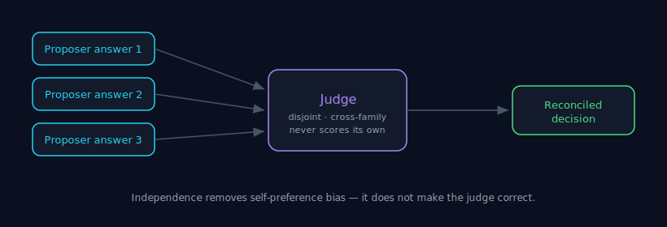

# Judge Independence

> Part of the [Council MCP](../README.md) documentation suite. Council owns the
> **decision**; the judge is how independent answers become one. See
> [Decision Theory](./decision-theory.md) for why independence matters at all.

**30-second version.** After the proposers answer in parallel and blind, a judge
reconciles them. The judge is **disjoint from the proposers** (it is not one of the
answering models), **cross-family** (a different lineage), and **never scores its
own answer**. This exists to defeat **self-preference bias** — a model asked to
grade answers, one of which is its own, tends to favour its own. An independent
judge removes that thumb from the scale.

---

## 1. What the judge does

The proposers produce several independent answers. The judge reads all of them and
produces the synthesis your chosen [mode](./consensus.md#2-pick-the-mode-by-intent)
asks for — a merged decision (`consensus`), an agreement/disagreement map (`diff`),
the strongest single answer (`best_of`), or answers-plus-reasoning (`full`). In
`raw` mode there is **no judge** at all — you get the proposers verbatim and decide
yourself.

The default judge is **Claude Haiku**. Override it with `judge_model`, or supply
`judge_models` (an array) for multi-judge `best_of`, where every listed model acts
as a judge and the backend keeps the strongest synthesis. (`judge_models` takes
precedence over `judge_model` when both are set.)

## 2. Why the judge must be independent

A judge that is also a proposer is grading its own work. Two failure modes follow:

- **Self-preference bias.** Models systematically rate their own outputs higher.
  If the judge is in the panel, the panel's "decision" drifts toward whatever the
  judge happened to say — the independence you paid for collapses back to one
  model's opinion.
- **Shared blind spots.** A judge from the *same family* as the proposers shares
  their training lineage and therefore their blind spots. It will nod along with a
  mistake its siblings made. A **cross-family** judge is more likely to notice.

So Council enforces three properties on the judge:

1. **Disjoint** — the judge is not one of the answering proposers.
2. **Cross-family** — a different model lineage from the proposers, chosen for
   decorrelation.
3. **Never self-scoring** — the judge does not score its own answer.

These are the same principles that make the *panel* useful (selection for
decorrelation over raw score); the judge is where they are enforced at the
reconciliation step. See [Bias](./bias.md) for the bias taxonomy.

## 3. The judge is a reconciler, not an oracle

Independence reduces one specific distortion (self-preference). It does **not** make
the judge correct. A cross-family judge can still share a blind spot with the
proposers, and can still be confidently wrong. This is why:

- Council is **advisory**, never an auto-trust merge gate. A judge verdict informs
  a decision; it does not authorise an irreversible action on its own (see
  [Verification](./verification.md) and [Failure Modes](./failure-modes.md)).
- The strongest correctness lever is still **[grounding](./grounding.md)** — giving
  the judge the real artifact — not the judge's independence.

> **Honesty.** The judge does not increase accuracy. Across our 5-domain benchmark
> the council ties the best single model and beats it in no domain; on SWE-bench it
> showed no measurable net uplift in catch rate (see [Benchmark
> Methodology](./benchmark-methodology.md)). The judge's job is to turn several
> answers into one *defensible, auditable* decision while preserving the
> disagreement — not to be right where the models were wrong.

## 4. Judge budget (operational detail)

The judge has to read every proposer's answer, so a flat output budget truncates
large multi-proposer syntheses. Council **auto-sizes** the judge's output budget
with the proposer count instead: a base of 4096 tokens plus 2048 per proposer,
clamped to the 4096–16384 range. You normally do not set this; raising your own
`max_tokens` only lifts the judge floor, never past the clamp.

---

### See also

- [Consensus](./consensus.md) — the fan-out and the synthesis modes.
- [Grounding](./grounding.md) — the strongest lever on decision quality.
- [Bias](./bias.md) — self-preference and the broader bias taxonomy.
- [Verification & Confidence](./verification.md) — why no judge is a guarantee.
- [Routing](./routing.md) — how proposers and judges are selected and region-routed.
