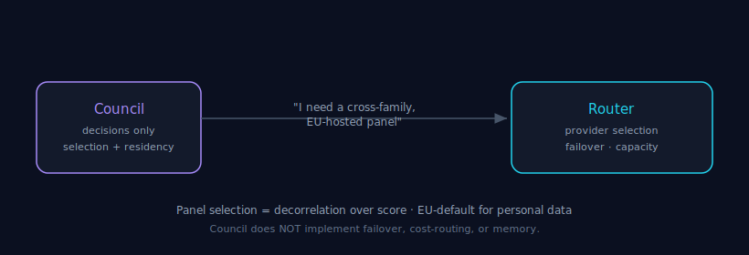

# Routing

> Part of the [Council MCP](../README.md) documentation suite. Read the boundary
> first: **Council does not own routing.** Provider/model routing is a separate
> Tokonomix responsibility ([the Router](../README.md#council-in-the-tokonomix-ecosystem)).
> Council only *consumes* routing to assemble a panel and to honour data residency.

**30-second version.** Council needs to pick *which* models form a decorrelated
panel and *where* they run (EU for personal data). It expresses those needs —
cross-family selection, region constraints — but the machinery that decides which
provider hosts a given call lives in the Router component, not here. This doc covers
the two routing concerns visible at the decision layer: **panel selection** and
**data-residency routing.**

---

## 1. The boundary: consume, don't own

In the [Tokonomix ecosystem](../README.md#council-in-the-tokonomix-ecosystem) each
component owns exactly one responsibility:

- **Routing → the Router** decides which provider/model hosts a call, handles
  failover, balances cost and capacity.
- **Decision → Council** assembles a decorrelated panel, runs the judge, and grounds
  the result.

Council *consumes* routing the way a code-review tool consumes a CI runner: it cares
that the right models are reachable in the right region, but it does not implement
provider failover or load-balancing. Keeping this boundary clean is why "routing"
appears here only as the two concerns below — selection and residency — and nowhere
as a Council feature to configure provider fallbacks.

## 2. Panel selection — decorrelation over score

The decision Council *does* make is **which models form the panel**, and it makes it
on **decorrelation, not leaderboard score** (the rationale: [Decision
Theory](./decision-theory.md), [Failure Modes
§4](./failure-modes.md#4-specialist--proposer-overlap--diminishing-and-negative-returns)).
A cross-family panel and a cross-family [independent judge](./judge-independence.md)
reduce shared blind spots better than stacking the single highest-scoring model with
near-copies.

You influence selection three ways:

- **Default council** — leave `models` empty on
  [`tokonomix_consensus_ask`](../README.md#tools) to use the **per-key or
  per-account default council** (configured server-side). Recommended: panel policy
  lives in configuration, not in every prompt.
- **Explicit panel** — pass `models` (2–6 bare slugs) and optionally
  `judge_model` / `judge_models`.
- **Discovery** — use [`tokonomix_list_models`](../README.md#tools) to find slugs,
  filtering by `provider`, `tier` (A/B/C), or capability (`supports`).

When you pin an explicit panel, models that cannot serve the request (for example a
non-vision model on an image prompt) are reported in the result's skipped list
rather than silently dropped — so the panel you got is auditable.

## 3. Data-residency routing — EU by default for personal data

The second routing concern visible at the decision layer is **where the models
run**, which matters whenever a prompt contains personal or regulated data.

- **Filter by region.** `tokonomix_list_models({ hosting_region: "eu" })` returns
  only EU-hosted models — `eu` matches `eu` **or** `fr`. Use it to build an
  EU-only council for GDPR-strict decisions.
- **Filter by origin.** `origin_country` (ISO 3166-1 alpha-2, e.g. `"FR"`, `"DE"`)
  filters by where the model's lab is headquartered — for sovereignty-aware
  selection beyond mere hosting location.
- **EU-default on sensitive paths.** Region-pinned features default to EU; for
  example, staged context is region-pinned EU by default (see
  [Grounding](./grounding.md)).

> **Decision rule.** For any prompt containing personal data, route to an EU
> council. This is a decision-quality *and* compliance concern, which is why it is
> surfaced at this layer even though the underlying routing is the Router's job.

## 4. What Council deliberately does not do here

- It does not implement provider **failover** or capacity balancing — that is the
  Router's responsibility.
- It does not pick a model to *save money on a routine call* — for cheap single-model
  reasoning use [`tokonomix_single_ask`](../README.md#tools); for cost-vs-recall
  trade-offs see [Recall vs Precision](./recall-vs-precision.md).
- It does not remember your previous routing choices across sessions — memory is a
  separate component.

The honest framing: Council expresses *what* the panel and region must be for a good
decision; *how* those models are reached is routing's job, not Council's.

---

### See also

- [Architecture](./architecture.md) — where selection and routing sit in the pipeline.
- [Judge Independence](./judge-independence.md) — cross-family selection of the judge.
- [Grounding](./grounding.md) — EU-default region pinning for staged context.
- [Decision Theory](./decision-theory.md) — why decorrelation beats raw score.
