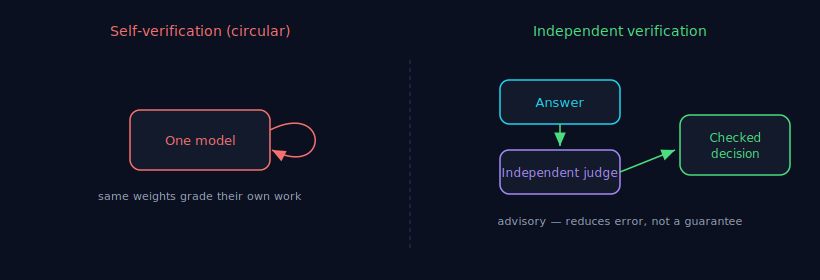

# Verification

> Part of the [Council MCP](../README.md) documentation suite. Council adds a
> **verification / QA layer** to AI output. This doc states precisely what that
> layer does — and what it does **not** — so you never mistake it for a guarantee.

**30-second version.** A single model cannot verify itself: the weights that produce
an answer produce its self-assessment. Council adds *independent* verification — a
separate panel and a separate judge reason over the same problem — which **reduces
single-model error and surfaces disagreement**. It does **not** guarantee
correctness. Verification feeds judgement; it does not replace the party
accountable for the outcome.

---

## 1. The fundamental argument: a model cannot verify itself

Ask one model "is this correct?" and the same estimator that may have made the
error is also grading it. A model that is wrong is frequently wrong *and confident*;
"are you sure?" does not add an independent check, because there is no independence —
it is the same weights answering twice.

This is the structural reason verification needs a **second party**. It is not that
GPT or Claude are weak; it is that self-verification is logically circular. Council
provides the second party: independent proposers and an independent, cross-family
[judge](./judge-independence.md) that did not produce the answer being checked.

## 2. What Council verifies

- **Cross-model agreement and disagreement.** It surfaces where independent models
  *diverge* — the divergence a single model would have hidden. In
  [`diff`](./consensus.md#2-pick-the-mode-by-intent) mode this is the entire output:
  an agreements/disagreements map (the judge **compares, it does not decide**).
- **Recall on catchable issues.** With several decorrelated models, an issue only
  one of them notices still surfaces (a recall amplifier).
- **Grounded claims, when you supply the artifact.** With
  [grounding](./grounding.md), verification is against the real thing, not the
  model's memory of it — the strongest form available.

## 3. What Council does NOT verify

- **It is not a correctness oracle.** Everything above reduces single-model error;
  none of it *guarantees* the answer is right. Our own runs show **no measurable
  net uplift in catch rate** on a SWE-bench defect set and a **tie** with the best
  single model on clean accuracy (see [Benchmark
  Methodology](./benchmark-methodology.md)). Council does not claim "more accurate."
- **It cannot catch a shared blind spot.** If every proposer and the judge miss the
  same thing, verification passes and the bug ships. Grounding mitigates this;
  headcount does not (see [Failure Modes](./failure-modes.md)).
- **It is advisory, never an auto-trust merge gate.** A passing verification informs
  a decision; it does not authorise an irreversible action on its own. Treating its
  output as authority is mistaking a tool for a guarantee.

## 4. Verification is a layer, not a verdict

Council sits *next to* the thing that acts, not in place of the party that answers
for the outcome. In the [ecosystem](../README.md#council-in-the-tokonomix-ecosystem)
this is explicit: **execution** is ANS's job; **verification** is Council's; the
**human stays ultimately accountable.** The right mental model is a code review, not
a CI gate that auto-merges: it raises issues for a decision-maker, and the
decision-maker decides.

---

### See also

- [Confidence](./confidence.md) — why agreement raises confidence, not correctness.
- [Bias](./bias.md) — the biases verification does and does not remove.
- [Judge Independence](./judge-independence.md) — the second-party check.
- [Failure Modes](./failure-modes.md) — where verification passes but is wrong.
- [Grounding](./grounding.md) — making verification reason over the real artifact.
